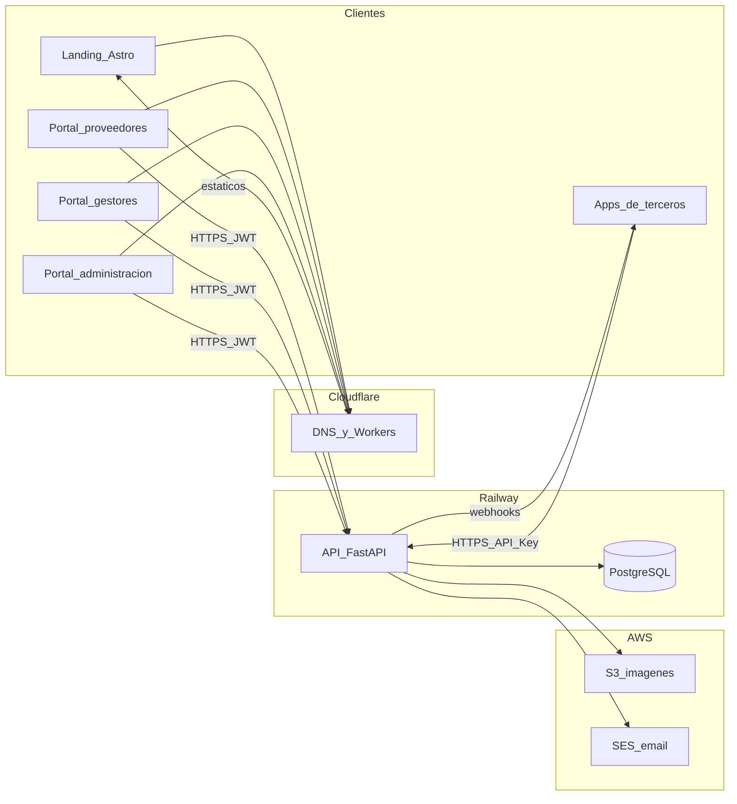
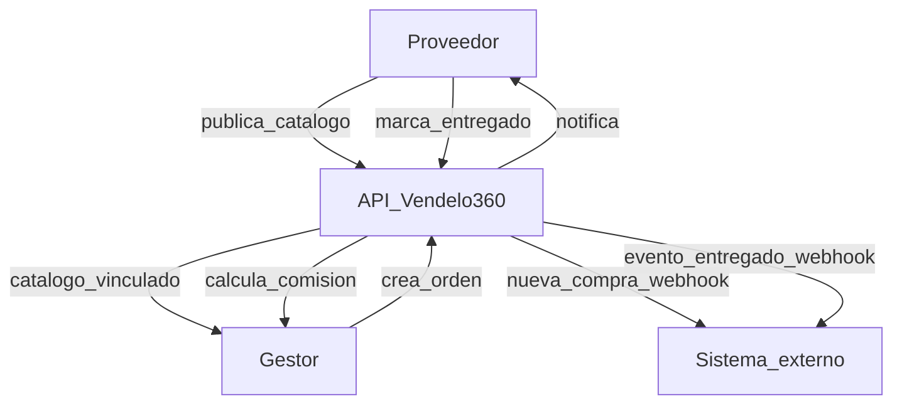

Caso de estudio técnico: cómo se diseñó y desplegó **Vendelo360**, una plataforma que conecta proveedores de productos con gestores de venta mediante un backend abierto, portales web y un modelo de integración pensado para terceros.

## 1. Qué es Vendelo360

Vendelo360 es una plataforma **B2B**: no vende al comprador final. Conecta a quien tiene el catálogo (**proveedores**) con quien promociona y cierra la venta (**gestores**). El comprador no usa la aplicación; sus datos viajan dentro de la orden.

Hoy ese flujo suele vivir en grupos de WhatsApp, fotos reenviadas y libretas de comisiones. Vendelo360 centraliza catálogo, pedidos y comisiones, y deja el **backend como contrato HTTP** para que otras aplicaciones puedan automatizar el mismo negocio.

## 2. Objetivos y dominio de negocio

### Problema

- Catálogos y precios desactualizados entre el proveedor y quien vende.
- Pedidos por chat o Excel: lentos y con errores.
- Comisiones calculadas a mano al final del día.

### Actores

| Actor | Rol |
|--------|-----|
| **Proveedor** | Publica el catálogo una sola vez, recibe pedidos ordenados y paga comisiones exactas. |
| **Gestor de venta** | Explora el catálogo vinculado, registra la venta (carrito + datos del comprador) y cobra su comisión. |
| **Administrador de plataforma** | Opera Vendelo360 a escala global: organizaciones, usuarios, soporte, monitoreo y auditoría. No gestiona el catálogo de un tenant concreto. |
| **Comprador** | No entra en la app; recibe el producto y paga en la entrega. |

### Valor estratégico

Las interfaces web validan el producto y cubren la operación diaria. El activo a largo plazo es el **backend API-first**: el mismo contrato sirve a los portales oficiales, a un sitio propio del gestor o a un ERP del proveedor.

## 3. Arquitectura general

Todo vive en un **monorepo**: dependencias Node con **pnpm workspaces** y el servicio API con **uv** (Python). Un único backend REST alimenta varios clientes.

| Pieza | Carpeta | Rol |
|--------|---------|-----|
| Landing | `apps/landing` | Sitio de prelanzamiento / marketing (estático). |
| Portal proveedores | `apps/backoffice` | Catálogo, pedidos, comisiones, equipo y vínculo con gestores. |
| Portal gestores | `apps/seller` | Catálogo vinculado, carrito, órdenes, clientes y comisiones. |
| Portal administración | `apps/admin` | Operación global de la plataforma (super-admin). |
| API | `services/api` | Punto único de verdad: datos, reglas e integraciones. |
| Cliente tipado | `packages/api` | OpenAPI → Orval → hooks de TanStack Query. |
| UI compartida | `packages/ui` | Shell, CRUD, componentes de dominio (pedidos, comisiones, org). |

Los tres portales React y cualquier aplicación de terceros hablan con la **misma API**. La landing no llama al backend: es contenido estático.

## 4. Lenguajes, frameworks y componentes

### Backend

- **Python 3.12**, gestión de entorno y dependencias con **uv**.
- **FastAPI** + **Uvicorn**: API REST asíncrona con documentación OpenAPI nativa.
- **SQLModel** (sobre SQLAlchemy/Pydantic) para el modelo de dominio.
- **Alembic** para migraciones.
- **PostgreSQL** vía **asyncpg**.
- Almacenamiento de imágenes compatible con **S3** (**aioboto3**; MinIO en local, AWS S3 en producción).
- Correo transaccional por **SMTP** (**aiosmtplib**; Amazon SES en producción).
- Máquina de estados de ítems de pedido con **transitions**.
- Bus de eventos interno para efectos secundarios (email, comisiones, webhooks).

Organización del servicio: rutas delgadas → servicios de dominio → modelos/persistencia, con dependencias de seguridad centralizadas (JWT, API keys, `organization_id`).

### Frontends de negocio y administración

Los portales de proveedores, gestores y administración comparten stack:

- **React 19**, **TypeScript**, **Vite 8**
- **React Router 7**
- **TanStack Query** (datos remotos)
- **Zustand** (estado local; p. ej. carrito del gestor)
- **Tailwind CSS 4**
- Formularios con **React Hook Form** + **Zod** en los flujos de negocio

El portal de administración reutiliza el mismo shell, autenticación JWT y cliente generado; su alcance es **global** (operadores con privilegio de super-admin), no el `organization_id` de un proveedor o gestor.

### Landing

- **Astro 7** + Tailwind 4: sitio multipágina estático, sin llamadas a la API.

### Paquetes compartidos

- **`@broker/api`**: el esquema OpenAPI se exporta desde FastAPI y se genera el cliente con **Orval** (mutator con Bearer / API key e inyección de `organization_id`).
- **`@broker/ui`**: kit estilo shadcn/Radix, layout, tablas CRUD, flujos de organización (invitaciones, membresía) y piezas de pedidos/comisiones/dashboard reutilizadas por los portales.

### Dominio que cubre la API

- Organizaciones multi-tenant (`provider` / `seller`) y vínculo proveedor–gestor
- Catálogo, etiquetas e imágenes (presign + confirmación)
- Órdenes e ítems con ciclo de vida (creado → revisado → enviado → entregado / cancelado)
- Comisiones al entregar
- Clientes y direcciones del gestor
- Dashboards, invitaciones por email y verificación de cuenta
- Claves de API para automatización
- Webhooks hacia sistemas externos ante eventos de negocio

## 5. Backend abierto: headless por diseño

Vendelo360 no acopla la lógica de negocio a una sola interfaz. La API es un **backend headless**:

1. **Un solo contrato REST** — las SPAs son clientes; no son dueñas de las reglas.
2. **CORS abierto** (`allow_origins=["*"]`) — la autenticación se resuelve con JWT o API key, no filtrando orígenes.
3. **Documentación viva** — Swagger (`/docs`), ReDoc (`/redoc`) y el esquema en `/openapi.json`.
4. **Misma superficie para humanos y máquinas** — un gestor puede montar su propia web, un proveedor sincronizar inventario desde su ERP, o un script crear órdenes, sin pasar por los portales oficiales.

En la práctica: si construyes un escaparate o un conector, consumes Vendelo360 como CMS/backend de catálogo y pedidos; los portales oficiales son solo la primera implementación de ese contrato.

## 6. Integraciones con aplicaciones de terceros

El modelo es de **dos direcciones**: la aplicación externa puede **tirar** (pull) de la API y Vendelo360 puede **empujar** (push) eventos por webhook.

### Pull — la app llama a Vendelo360

1. Un usuario autentica con email/contraseña y obtiene un **JWT**, o genera una **API key** (`X-API-Key`, formato `bk_…`) para procesos automáticos.
2. Cada operación de negocio lleva el contexto de tenant: **`organization_id`** (query).
3. Con eso se hace CRUD de catálogo, pedidos, clientes, etc., igual que los portales.
4. Las imágenes se suben con **URL prefirmada** a S3: el cliente hace PUT directo al almacenamiento (también desde un origen de terceros).

Flujo típico de un integrador:

```text
Crear API key → autenticar cada request → pasar organization_id
→ leer/escribir catálogo u órdenes → (opcional) confirmar imágenes vía presign
```

### Push — Vendelo360 avisa a la app

Las organizaciones registran una **URL de webhook** y los eventos que les interesan. El **bus de eventos** interno —el mismo que dispara correos y asigna comisiones— publica hacia esos endpoints HTTP.

Ejemplos de eventos:

- **Nueva compra / orden creada**
- Cambio de estado de un ítem (enviado, entregado, cancelado)
- Comisión generada

El receptor (ERP, tienda, automatización) reacciona **sin polling**. Ese contrato es la base natural para conectores hacia Shopify, WooCommerce, Odoo u otros sistemas: no hace falta un plugin empaquetado para empezar; basta con REST + webhooks.

## 7. Cómo se desplegó y por qué

La producción prioriza **coste bajo**, piezas managed y frontends estáticos en el edge. Dominio de referencia: **vendelo360.app**.

| Pieza | Dónde | Por qué |
|--------|--------|---------|
| Landing + tres SPAs | **Cloudflare Workers** (static assets) | HTML/JS estático, CDN global, coste ~0; no hace falta un Node 24/7. Subdominios: apex, `proveedores.`, `gestores.`, `admin.` |
| API + PostgreSQL | **Railway** (Docker; Alembic al arrancar, luego Uvicorn) | PaaS simple, Postgres en red privada, plan Hobby suficiente al inicio |
| Imágenes | **AWS S3** (MinIO compatible en local) | Presign; el mismo cliente S3 sirve en desarrollo y producción |
| Correo de salida | **Amazon SES** (SMTP) | Transaccional (verificación, invitaciones) sin montar un servidor de correo |
| Correo de entrada | **Cloudflare Email Routing** | `info@` / `hola@` hacia un buzón existente, sin IMAP de pago |
| DNS | **Cloudflare** | Apex con Workers + MX de Email Routing a la vez; SSL gestionado |

### Coste orientativo

| Pieza | Coste aproximado |
|--------|------------------|
| Dominio (Cloudflare Registrar) | ~10–12 USD/año |
| Workers (static assets) + DNS + Email Routing | 0 USD |
| Railway Hobby (API + Postgres) | ~5–15 USD/mes |
| S3 (imágenes) | céntimos al inicio |
| SES (correo transaccional) | ~0.10 USD / 1000 emails |

En la práctica, el despliegue completo arranca en el orden de **5–15 USD/mes** más el dominio anual.

## 8. Decisiones de diseño que suelen pasar desapercibidas

- **Multi-tenant por organización**, no por usuario suelto. Un usuario puede pertenecer a varias orgs; el tipo (`provider` / `seller`) define qué rutas puede usar.
- **Super-admin** entra por el portal de administración y bypasea comprobaciones de membresía en la API. Las **API keys** están pensadas para integraciones de tenant, no para operadores de plataforma.
- **Máquina de estados** en el ítem de pedido: solo transiciones válidas. Al marcar **entregado**, el bus de eventos asigna comisión y puede notificar por webhook.
- **Código generado desde OpenAPI**: un contrato, varios clientes tipados; menos drift entre backend y frontends.
- **Presign de S3**: la API no proxya binarios grandes; escala mejor y funciona igual para apps de terceros.
- **Tests (pytest)** como documentación ejecutable del contrato de auth, tenancy y flujos críticos.

## 9. Diagramas

### Componentes e interacción



### Flujo de negocio



## 10. Cierre

Vendelo360 combina tres ideas:

1. **Producto B2B claro** — proveedor, gestor y operación de plataforma, sin mezclarse con un ecommerce B2C.
2. **Backend headless** — REST documentado, JWT y API keys, webhooks para eventos (incluidas nuevas compras), listo para otras aplicaciones.
3. **Despliegue pragmático** — frontends estáticos en Cloudflare, API y Postgres en Railway, S3 y SES en AWS, coste controlado desde el día uno.

### URLs de referencia

| Superficie | Host |
|------------|------|
| Landing | `https://vendelo360.app` |
| Proveedores | `https://proveedores.vendelo360.app` |
| Gestores | `https://gestores.vendelo360.app` |
| Administración | `https://admin.vendelo360.app` |
| API | `https://api.vendelo360.app` |
